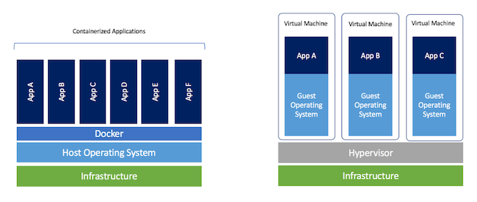
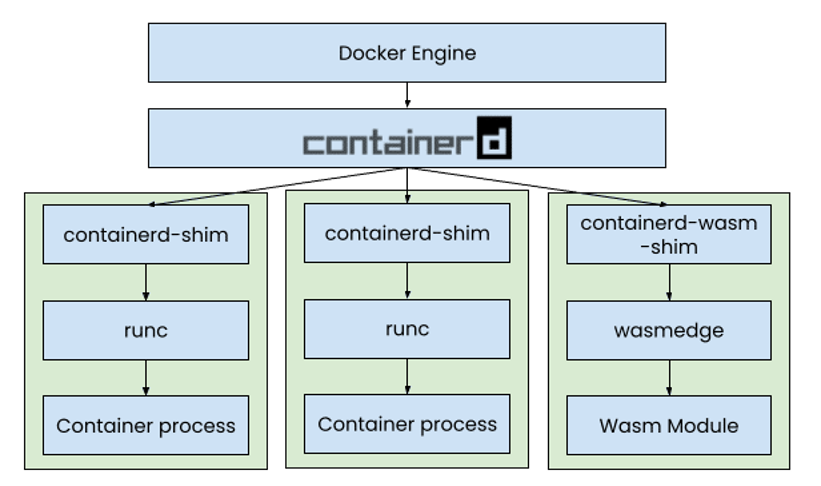
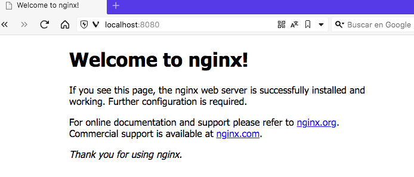
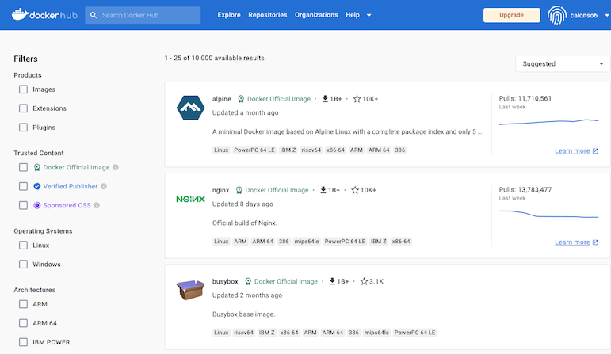

# Primera sessió

- [Introducció](#introducció)
- [Instal·lació](#installació)
- [Creant contenidors](#creant-contenidors)
- [Gestionant contenidors](#gestionant-contenidors)
- [Imatges](#imatges)
- [Per practicar online](#per-practicar-online)
- [Eines i utilitats](#eines-i-utilitats)

## Introducció

Docker és una plataforma que permet als desenvolupadors crear, desplegar i executar aplicacions fàcilment en contenidors. Els contenidors són entorns lleugers, portàtils i autònoms que es poden executar en qualsevol màquina amb Docker instal·lat. Això fa que sigui fàcil desenvolupar i desplegar aplicacions en diferents entorns, sense preocupar-se per les dependències o problemes de compatibilitat.

Si ho comparem amb una màquina virtual, un contenidor comparteix el SO, s'executa com un procés aïllat en l'espai d'usuari i pot iniciar-se en mil·lisegons. A més, els contenidors ocupen menys espai que les màquines virtuals, ja que no necessiten un sistema operatiu complet.



Docker es pot utilitzar en els equips clients per tal de disposar d'entorns de desenvolupament lleugers i portàtils, i també en els servidors per desplegar aplicacions de forma ràpida i escalable.

L'arquitectura de Docker es basa en `Docker Engine` que és el CLI amb el que interactua l'usuari. L'altre component, `containerd` gestiona el cicle de vida complet dels contenidors que s'executen en el sistema. Per defecte, `runc` és el runtime que s'utilitza per executar-los, però a les darreres versions (encara en mode experimental), hi ha la possibilitat d'usar com a runtime `wasmtime`, que permet executar contenidors que utilitzin WebAssembly. El mecanisme de comunicació entre `containerd` i els runtime és a través de `containerd-shim`, que és un procés intermediari que permet gestionar els contenidors de forma més eficient.



Les imatges que són les plantilles que permeten executar contenidors es poden obtenir dels registres, el propi de Docker és Docker Hub [link](https://hub.docker.com/), però també n'hi ha d'altres com GitHub Packets o fins i tot crear un per la nostra organització.

Docker es pot utilitzar tant en entorns Windows, macOS i Linux i fins i tot en Raspberry Pi. Ara, els contenidors creats només poden ser Linux o Windows, aquest últims només es poden executar en màquines Windows. De fet, la immensa majoria de contenidors que trobarem són Linux.

En el cas dels equips Windows, es poden executar contenidors Linux gràcies al WSL2 (Windows Subsystem for Linux 2), que permet executar un kernel Linux en Windows. A macOS, Docker utilitza una màquina virtual per executar els contenidors.

En entorns de servidor, Docker s'utilitza per desplegar les aplicacions en contenidors, però també per desplegar serveis com ara bases de dades, servidors web, etc. Això permet tenir un entorn escalable i fàcil de mantenir.

Ara farem una introducció a l'ús de Docker a l'equip client, perquè serà amb ell que hi treballarem amb els servidors web i d'aplicacions com alternativa a utilitzar màquines virtuals.

## Instal·lació

Per instal·lar Docker en un sistema Windows 10, cal seguir els següents passos:

- Instal·lar WSL2 (Windows Subsystem for Linux 2)[link](https://learn.microsoft.com/en-us/windows/wsl/install)
- Instal·lar Docker Desktop [link](https://docs.docker.com/docker-for-windows/install/)

Per instal·lar Docker en un sistema macOS, cal seguir els següents passos:

- Instal·lar Docker Desktop [link](https://docs.docker.com/docker-for-mac/install/)

A part d'instal·lar-nos el programa, també ens instal·larà la CLI de Docker, que ens permetrà gestionar els contenidors des de la terminal.

Per poder utilitzar les imatges de Docker, cal crear un compte a [Docker Hub](https://hub.docker.com/). És gratuït per ús personal.

Ara ja ens podem validar a l'aplicació de Docker Desktop amb el nostre compte de Docker Hub. Apareix a la barra d'eines amb el logo de la balena.

Podem comprovar que Docker funciona, comprovant la versió que s'ha instal·lat:

```powershell
docker --version
```

## Creant contenidors

### El nostre primer contenidor (Hello World)

Un cop es té Docker instal·lat a l'equip i el compte de Docker Hub creat, podem començar a crear els nostres propis contenidors.

Començarem utilitzant el terminal per crear un contenidor molt senzill:

```powershell
docker run hello-world
```

Si observem els missatges, veurem el següent:

- No troba la imatge en local, per tant se la baixa del registre, en aquest cas Docker Hub.
- Un cop baixada, executa el contenidor, en aquest cas, ens mostra un missatge de benvinguda amb informació sobre Docker. Un cop el contenidor ha acabat la seva feina, s'atura.

```powershell
Unable to find image 'hello-world:latest' locally
latest: Pulling from library/hello-world
719385e32844: Pull complete 
Digest: sha256:4f53e2564790c8e7856ec08e384732aa38dc43c52f02952483e3f003afbf23db
Status: Downloaded newer image for hello-world:latest

Hello from Docker!
This message shows that your installation appears to be working correctly.

To generate this message, Docker took the following steps:
 1. The Docker client contacted the Docker daemon.
 2. The Docker daemon pulled the "hello-world" image from the Docker Hub.
    (amd64)
 3. The Docker daemon created a new container from that image which runs the
    executable that produces the output you are currently reading.
 4. The Docker daemon streamed that output to the Docker client, which sent it
    to your terminal.

To try something more ambitious, you can run an Ubuntu container with:
 $ docker run -it ubuntu bash

Share images, automate workflows, and more with a free Docker ID:
 https://hub.docker.com/

For more examples and ideas, visit:
 https://docs.docker.com/get-started/
```

Ja podeu veure que un contenidor executa un procés i que quan acaba aquest procés, el contenidor s'atura.

### Contenidors interactius

Ara que ja sabem com crear un contenidor, podem crear-ne un d'interactiu, per exemple, un contenidor Ubuntu amb una consola de bash:

```powershell
docker run -it ubuntu /bin/bash
```

Això ens obrirà un contenidor Ubuntu amb un terminal bash. Observeu com l'usuari del contenidor és **root**. Això és una altra característica de Docker, per defecte, l'usuari amb el que s'executa a dinsd de l'entorn del contenidor és root.

```powershell
root@8c03b7617fe3:/# 
root@8c03b7617fe3:/# cat /etc/os-release 
PRETTY_NAME="Ubuntu 22.04.3 LTS"
NAME="Ubuntu"
VERSION_ID="22.04"
VERSION="22.04.3 LTS (Jammy Jellyfish)"
VERSION_CODENAME=jammy
ID=ubuntu
ID_LIKE=debian
HOME_URL="https://www.ubuntu.com/"
SUPPORT_URL="https://help.ubuntu.com/"
BUG_REPORT_URL="https://bugs.launchpad.net/ubuntu/"
PRIVACY_POLICY_URL="https://www.ubuntu.com/legal/terms-and-policies/privacy-policy"
UBUNTU_CODENAME=jammy
root@8c03b7617fe3:/# 
```

Si volem sortir del contenidor, podem fer-ho amb la comanda `exit`. En sortir, el contenidor s'atura.

### Contenidors en background

Els contenidors que hem creat fins ara s'executen en primer pla, però també podem crear contenidors que s'executin en background, per exemple, un contenidor amb un servidor web Nginx:

```powershell
docker run -d -p 8080:80 nginx
ed2aabfd9ea438f7553ab8ca5b545c3de0985078eb52ab433b8d06bb2faee6e6
```

El `-d` indica que s'executa en mode *dimoni* (en background) i el `-p` indica que el port 80 del contenidor es mapeja al port 8080 de l'equip host.

Això és útil perquè no ocupa el terminal de l'equip. En aquest cas, el contenidor com executa un procés que no finalitza, es queda executant-se en segon pla.



## Publicant ports

Els contenidors, per defecte, s'executen en una xarxa interna que Docker gestiona, però si volem que el contenidor sigui accessible des de l'equip host, cal mapejar els ports. Això és molt útil per exemple, perquè el nostre servidor web sigui accessible des de l'equip host.

Per mapejar un port, utilitzem l'opció `-p`:

```powershell
docker run -d -p 8080:80 nginx
```

En aquest cas, estem mapejant el port 80 del contenidor al port 8080 de l'equip host. Això vol dir, que si accedim a l'adreça `http://localhost:8080` des del navegador, veurem el servidor web Nginx.

## Gestionant contenidors

### Llistant contenidors

Hem anat creat contenidors, però com podem saber quins contenidors tenim en execució? Per això, podem utilitzar la comanda `ps`:

```powershell
docker ps
CONTAINER ID        IMAGE       COMMAND                  CREATED             STATUS              PORTS                  NAMES
ed2aabfd9ea4        nginx       "/docker-entrypoint.…"   4 minutes ago       Up 4 minutes        0.0.0.0:8080->80/tcp   silly_nobel
```

Ens diu que tenim un contenidor actiu, amb el nom `silly_nobel` i que està mapejat el port 8080 de l'equip host al port 80 del contenidor. A més, ens indica l'ID del contenidor, la imatge que s'ha utilitzat per crear-lo, la comanda que s'ha executat per crear-lo i el temps que fa que està en execució.

Si vulguéssim veure tots els contenidors, incloent els que estan aturats, podem utilitzar la opció `-a`:

```powershell
docker ps -a
CONTAINER ID        IMAGE         COMMAND                  CREATED             STATUS                    PORTS                NAMES
ed2aabfd9ea4        nginx         "/docker-entrypoint.…"   7 minutes ago       Up 7 minutes        0.0.0.0:8080->80/tcp   silly_nobel
8c03b7617fe3        ubuntu        "/bin/bash"              18 minutes ago      Exited (127) 9 minutes ago                 ager_cohen
f76ccee34cb8        hello-world   "/hello"                 25 minutes ago      Exited (0) 25 minutes ago             awesome_heyrovsky
```

El *CONTANINER ID* que mostra són els primers 6 bytes en hexadecimal del hash SHA256 que utilitza per identificar de forma única a un contenidor. Aquest identificador és el que utilitzarem per gestionar els contenidors (podem utilitzar només els primers caràcters). El nom del contenidor ho crea automàticament Docker, tot i que també li podem assignar un nosaltres.

### Aturant contenidors

Si volem aturar el contenidor que està actiu, simplement utilitzem la comanda `stop`:

```powershell
docker stop ed2aabfd9ea4
ed2aabfd9ea4
```

Si ara repetim la comanda `docker ps`, veurem que el contenidor ja no està actiu.

### Iniciant contenidors

Per iniciar un contenidor que està aturat, utilitzem la comanda `start`:

```powershell
docker start ed2aabfd9ea4
ed2aabfd9ea4
```

Aquest contenidor es recupera amb l'estat en què estava quan l'hem aturat. Tot i que sembla una bona forma de treballar amb contenidors, normalment, els contenidors s'aturen i s'eliminen, i quan es volen tornar a utilitzar, es tornen a crear. És a dir, volem que es comportin com els processos, que un cop utilitzats, es tanquen i quan es volen tornar a utilitzar, es tornen a crear.

### Eliminant contenidors

Si volem eliminar un contenidor, utilitzem la comanda `rm`:

```powershell
docker rm ed2aabfd9ea4
ed2aabfd9ea4
```

Per eliminar un contenidor, cal que estigui aturat prèviament.

Una opció molt útil és eliminar tots els contenidors que estan aturats, per això, podem utilitzar la comanda `prune`:

```powershell
docker container prune
WARNING! This will remove all stopped containers.
Are you sure you want to continue? [y/N] y
Deleted Containers:
8c03b7617fe3f7
f76ccee34cb8f7
```

### Executant comandes en contenidors

Si volem executar una comanda en un contenidor, podem utilitzar la comanda `exec`:

```powershell
docker run --rm -d -p 8000:80 --name webserver nginx
docker exec -it webserver /bin/bash
root@8c03b7617fe3:/# 
```

Això ens permet executar comandes en un contenidor que està en execució (si sortim de la sessió iterativa amb `exit`, el contenidor no s'atura). En aquest cas, hem executat una consola de bash en el contenidor en background Nginx que hem. A més, hem assignat un nom al contenidor amb l'opció `--name`, per tant, podem utilitzar aquest nom per identificar-lo. Quan aturem el contenidor, a més, aquest s'eliminarà automàticament, gràcies a haver utilitzat l'opció `--rm`.

### Logs dels contenidors

Si volem veure els logs d'un contenidor, podem utilitzar la comanda `logs`:

```powershell
docker logs webserver
```

### Informació dels contenidors

Si volem veure informació detallada d'un contenidor, podem utilitzar la comanda `inspect`:

```powershell
docker inspect webserver
```

## Imatges

Les imatges són les plantilles que permeten crear contenidors. Per defecte, Docker utilitza el registre de Docker Hub, però també podem utilitzar altres registres o crear-ne un de propi. I també podem crear imatges a partir d'altres imatges, això ens permetrà crear imatges personalitzades, per exemple, incloent la nostra aplicació web. Aquest és el mecanisme típic per desplegar aplicacions web via Docker.

Un concepte molt important, és que les imatges són immutables, és a dir, que un cop creades, no es poden modificar. Per tant, si volem modificar una imatge, cal crear-ne una de nova a partir de l'original.

### Llistant imatges

Per llistar les imatges que tenim en local, podem utilitzar la comanda `images`:

```powershell
docker images ls
REPOSITORY   TAG       IMAGE ID       CREATED        SIZE
nginx        latest    4e2d7f8efc8c   2 weeks ago    133MB
ubuntu       latest    7e0aa2d69a15   2 weeks ago    72.9MB
hello-world  latest    d1165f221234   3 months ago   13.3kB
```

### Baixant imatges

Si volem baixar una imatge, podem utilitzar la comanda `pull`:

```powershell
docker pull alpine
Using default tag: latest
latest: Pulling from library/alpine
Digest: sha256:69e70a79f2d41ab5d637de98c1e0b055206ba40a8145e7bddb55ccc04e13cf8f
Status: Image is up to date for alpine:latest
docker.io/library/alpine:latest
```

### Docker Hub

Hem vist com baixar imatges, però d'on es baixen i com sabem quin nom té la imatge? La resposta és que es baixen del registre que configureu, que per defecte és l'oficial de Docker, [Docker Hub](https://hub.docker.com). Aquest registre és públic i gratuït, però també es poden crear registres privats (opcions de pagament).



Podem explorar la pàgina del Hub per cercar les imatges que necessitem. Aquí cal tenir en compte que podem tenir diversos tipus d'imatges:

- **Oficials**: són les imatges que proporciona Docker, per exemple, les imatges de les distribucions Linux.
- **Verificades**: són imatges que proporcionen empreses, per exemple, imatges amb bases de dades, aplicacions, etc.
- **OSS esponsoritzades**: són imatges de la comunitat Open Source que estan patrocinades per Docker.
- **Comunitat**: imatges públiques que pugen usuaris, empreses i comunitats, però que no estan verificades.

Per un tema de seguretat, és important utilitzar sempre imatges de confiança, per tant, sempre que sigui possible triarem una imatge oficial o verificada.

### Eliminar imatges

Les imatges es poden eliminar amb la comanda `rmi`:

```powershell
docker rmi alpine
Untagged: alpine:latest
Untagged: alpine@sha256:69e70a79f2d41ab5d637de98c1e0b055206ba40a8145e7bddb55ccc04e13cf8f
Deleted: sha256:6dbb9cc540741b42c0d3618b1e873a0ff6d664fe9d88bcf8f8b6409c5c4e2a2f
Deleted: sha256:3f53bb00af94d6ed6b4b9d5616b8e9e1b1b5e7f7b1c4e4e6b6d6b7aae6e1d0f5
```

## Per practicar online

Si no podeu instal·lar Docker al vostre equip, podeu utilitzar un entorn de prova online:


[Play with Docker](https://labs.play-with-docker.com/).

## Eines i utilitats

Visual Code: [Visual Code](https://code.visualstudio.com/):

Extensions a instal·lar:

- Docker
- Remote Development
- SQL Server
- MySQL

Azure Data Studio: [Azure Data Studio](https://azuredatastudio.net/)

[Tornar a l'índex](README.md)
